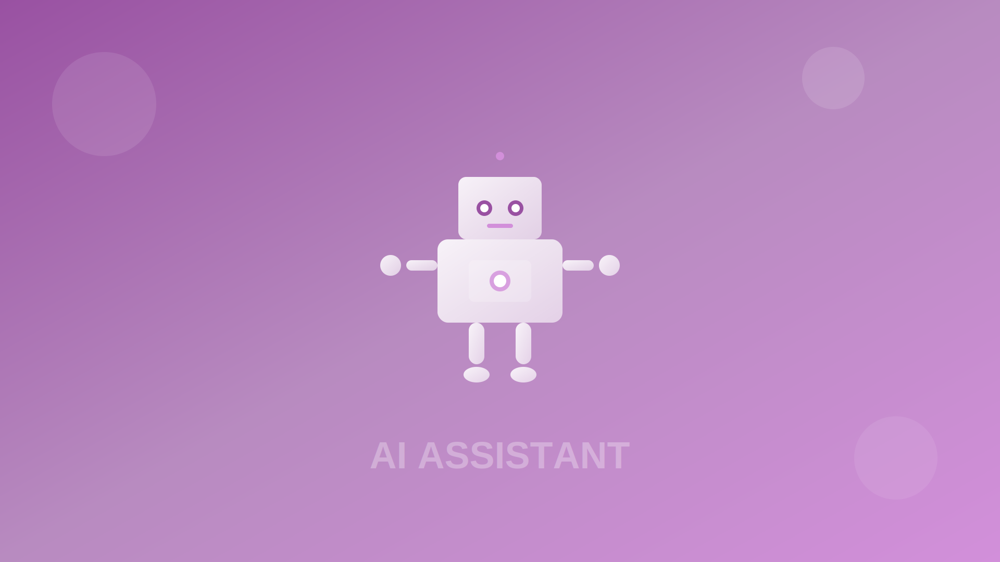

# 🚀 Harpio Sprint - Revolucionando o Recrutamento & Seleção com IA



## 💡 Visão

**Transformamos dados em decisões estratégicas para RH.**

A Harpio Sprint representa a vanguarda da revolução tecnológica no setor de Recursos Humanos, combinando análise avançada de dados com inteligência artificial generativa para transformar completamente os processos de recrutamento e seleção.

## 🔮 Nossa Tecnologia

Desenvolvemos uma plataforma proprietária que utiliza algoritmos de IA de última geração para analisar, otimizar e transformar os processos de R&S, reduzindo custos operacionais e maximizando o ROI dos departamentos de RH.

### Principais Diferenciais Técnicos

- **🧠 IA Generativa**: Integração avançada com Google Gemini para análises preditivas
- **📊 Analytics em Tempo Real**: Processamento de métricas de R&S com visualização instantânea
- **🔄 Arquitetura Serverless**: Infraestrutura escalável e de alta disponibilidade
- **🔒 Segurança por Design**: Proteção de dados sensíveis em todos os níveis da aplicação
- **⚡ Performance Otimizada**: Processamento de grandes volumes de dados com baixa latência

## 🛠️ Stack Tecnológica

Nossa plataforma foi construída utilizando tecnologias de ponta:

```
Frontend: JavaScript Avançado + Frameworks Modernos
Backend: Arquitetura Serverless + APIs Seguras
IA: Integração com Google Gemini API
Infraestrutura: Vercel + CI/CD Automatizado
Segurança: Criptografia de Ponta a Ponta + Gestão Segura de Credenciais
```

## 📈 Impacto nos Negócios

A Harpio Sprint não é apenas uma ferramenta, mas um parceiro estratégico que:

- **Reduz em até 60%** os custos operacionais de R&S
- **Aumenta em 40%** a assertividade nas contratações
- **Diminui em 35%** o tempo médio de preenchimento de vagas
- **Melhora em 25%** os índices de retenção de talentos

## 🔬 Inovação Contínua

Nossa equipe de engenharia trabalha constantemente para expandir as capacidades da plataforma:

- Algoritmos de matching candidato-vaga com precisão superior
- Análise preditiva de performance baseada em dados históricos
- Otimização contínua dos modelos de IA para resultados cada vez mais precisos
- Integração perfeita com sistemas legados de RH

## 🌐 Arquitetura Distribuída

A plataforma foi projetada com uma arquitetura moderna e distribuída:

```
┌─────────────────┐     ┌─────────────────┐     ┌─────────────────┐
│                 │     │                 │     │                 │
│  Frontend App   │────▶│  API Gateway    │────▶│  IA Processing  │
│                 │     │                 │     │                 │
└─────────────────┘     └─────────────────┘     └─────────────────┘
                                │                        │
                                ▼                        ▼
                        ┌─────────────────┐     ┌─────────────────┐
                        │                 │     │                 │
                        │  Data Analytics │◀────│  Secure Storage │
                        │                 │     │                 │
                        └─────────────────┘     └─────────────────┘
```

## 🔐 Segurança e Conformidade

Priorizamos a segurança dos dados em todos os aspectos:

- **Criptografia**: Dados em trânsito e em repouso sempre criptografados
- **Autenticação**: Sistemas robustos de verificação de identidade
- **Autorização**: Controle granular de acesso baseado em funções
- **Auditoria**: Logs detalhados de todas as operações do sistema
- **Conformidade**: Aderência total à LGPD e outras regulamentações

## 🚀 Próximos Passos

Estamos constantemente evoluindo nossa plataforma com:

- **Expansão dos modelos de IA**: Incorporação de novos algoritmos e técnicas
- **Análise preditiva avançada**: Previsões cada vez mais precisas sobre tendências de RH
- **Integrações expandidas**: Conexão com mais sistemas e plataformas de RH
- **Personalização avançada**: Adaptação automática às necessidades específicas de cada cliente

---

*© 2025 Harpio Technologies. Todos os direitos reservados.*
*Este é um software proprietário. Não é permitida a redistribuição sem autorização expressa.*
